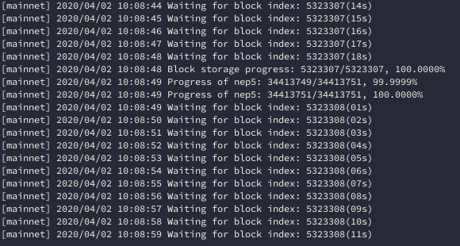

# Squirrel

[](https://github.com/neonextclub/squirrel/blob/master/LICENSE)
[](https://travis-ci.org/github/NeoNextClub/squirrel)
[](https://goreportcard.com/report/github.com/NeoNextClub/squirrel)
[](https://www.codacy.com/gh/NeoNextClub/squirrel?utm_source=github.com&amp;utm_medium=referral&amp;utm_content=NeoNextClub/squirrel&amp;utm_campaign=Badge_Grade)

Squirrel is a program that parses and persists NEO blockchain data into MySQL database, including UTXO transfers, NEP5 transfers, address balances and other statistical data.



## Features

- Fast blockchain data sync.
- Supports multi-fullnode as data sources to avoid SPOF.
- Independent sync targets in different task goroutines, easy to modify, stop or restart.
- Mail alert if unexpected panic happened(Optional).
- All are sql transactions, safe to `Ctrl+C` at any time for any reason.

## Build and Running

> Go 1.12+ is recommended to build and run this program. For Go 1.11.*, please make sure the environment variable `GO111MODULE` is set to `on`.

1. Clone this repo to your local directory:

```bash
git clone https://github.com/NeoNextClub/squirrel.git
```

2. Create database:

Execute all SQL statements in `./sqls/create_table.sql` to create database and tables.

3. Copy `config.sample.json` as `config.json` and fill the configurations:

```bash
cp ./config/config.sample.json ./config/config.json
vim config/config.json
```

4. Build source code and run:

```bash
# For go 1.13 and above, the following go proxy is recommended:
# go env -w GOPROXY=https://goproxy.cn,direct
# Visit https://goproxy.cn for detailed info.

# Install dependencies and build binary
go get -v -t ./... && go build
# Run squirrel, you can attach -mail flag to enable mail alert.
./squirrel
```

## DB Size

Here is the space size used on different networks(for reference) under MySQL 5.7.

| Network      | Block Height | Size  |
| ------------ |:------------:| -----:|
| Mainnet      | 5,320,000    | ~156G |
| TestNet      | 4,070,000    | ~51G  |

## Reset Sync Tasks

Currently there are 3 individual tasks except the main block data sync task:
* NEP5 Transfers Sync Task.
* UTXO Transfers Sync Task.
* gas Daily Balance sync Task.

If you want to add extra columns or make some changes to the existing tables that being used by these tasks,
then you may want to restart these tasks from beginning,
to clear these related tables/data, run the following sqls:

> :bulb: Please make sure the `squirrel` program is stopped before executing these sqls.

**NEP5 Transfers Sync Task**

```sql
DELETE FROM `addr_asset` WHERE LENGTH(`asset_id`) = 40;
DELETE FROM `addr_tx` WHERE `asset_type` = 'nep5';
UPDATE `address` SET `trans_nep5` = 0 WHERE 1 = 1;
UPDATE `counter` SET
	`last_tx_pk_for_nep5` = 0,
	`app_log_idx` = -1
WHERE `id` = 1;
TRUNCATE TABLE `nep5`;
TRUNCATE TABLE `nep5_reg_info`;
TRUNCATE TABLE `nep5_tx`;
TRUNCATE TABLE `nep5_migrate`;
DELETE FROM `address` WHERE `trans_asset` = 0 AND `trans_nep5` = 0;
UPDATE `counter` SET `nep5_tx_pk_for_addr_tx` = 0 WHERE `id` = 1;
```

**UTXO Transfers Sync Task**

```sql
TRUNCATE TABLE `utxo`;
DELETE FROM `addr_asset` WHERE LENGTH(`asset_id`) = 66;
DELETE FROM `addr_tx` WHERE `asset_type`='asset';
UPDATE `counter` SET
    `last_tx_pk` = 0,
    `cnt_tx_reg` = 0,
    `cnt_tx_miner` = 0,
    `cnt_tx_issue` = 0,
    `cnt_tx_invocation` = 0,
    `cnt_tx_contract` = 0,
    `cnt_tx_claim` = 0,
    `cnt_tx_publish` = 0,
	`cnt_tx_enrollment` = 0
WHERE `id` = 1;
UPDATE `asset` SET `addresses` = 0, `available` = 0, `transactions` = 0;
UPDATE `address` SET `trans_asset` = 0;
TRUNCATE TABLE `asset_tx`;
UPDATE `counter` SET `last_asset_tx_pk` = 0 WHERE `id` = 1;
```

**GAS Daily Balance Sync Task**

```sql
TRUNCATE TABLE `addr_gas_balance_a`;
TRUNCATE TABLE `addr_gas_balance_b`;
TRUNCATE TABLE `addr_gas_balance_c`;
TRUNCATE TABLE `addr_gas_balance_d`;
TRUNCATE TABLE `addr_gas_balance_e`;
TRUNCATE TABLE `addr_gas_balance_f`;
TRUNCATE TABLE `addr_gas_balance_g`;
TRUNCATE TABLE `addr_gas_balance_h`;
TRUNCATE TABLE `addr_gas_balance_i`;
TRUNCATE TABLE `addr_gas_balance_j`;
TRUNCATE TABLE `addr_gas_balance_k`;
TRUNCATE TABLE `addr_gas_balance_l`;
TRUNCATE TABLE `addr_gas_balance_m`;
TRUNCATE TABLE `addr_gas_balance_n`;
TRUNCATE TABLE `addr_gas_balance_o`;
TRUNCATE TABLE `addr_gas_balance_p`;
TRUNCATE TABLE `addr_gas_balance_q`;
TRUNCATE TABLE `addr_gas_balance_r`;
TRUNCATE TABLE `addr_gas_balance_s`;
TRUNCATE TABLE `addr_gas_balance_t`;
TRUNCATE TABLE `addr_gas_balance_u`;
TRUNCATE TABLE `addr_gas_balance_v`;
TRUNCATE TABLE `addr_gas_balance_w`;
TRUNCATE TABLE `addr_gas_balance_x`;
TRUNCATE TABLE `addr_gas_balance_y`;
TRUNCATE TABLE `addr_gas_balance_z`;
TRUNCATE TABLE `addr_gas_balance_0`;
TRUNCATE TABLE `addr_gas_balance_1`;
TRUNCATE TABLE `addr_gas_balance_2`;
TRUNCATE TABLE `addr_gas_balance_3`;
TRUNCATE TABLE `addr_gas_balance_4`;
TRUNCATE TABLE `addr_gas_balance_5`;
TRUNCATE TABLE `addr_gas_balance_6`;
TRUNCATE TABLE `addr_gas_balance_7`;
TRUNCATE TABLE `addr_gas_balance_8`;
TRUNCATE TABLE `addr_gas_balance_9`;
UPDATE `counter` SET `last_tx_pk_gas_balance` = 0 WHERE `id` = 1;
```
